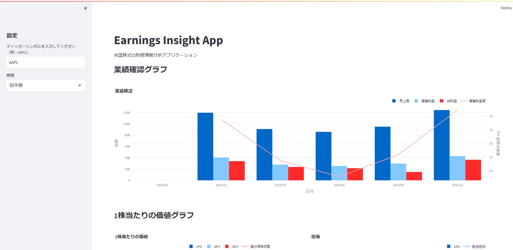

# Earnings Insight App



米国株式市場に上場している企業の財務情報を取得、分析、可視化するための Web アプリケーションです。

## 機能

- 指定した企業（ティッカーシンボル）の財務データを取得
- 以下の財務情報をグラフで可視化
  - 業績確認（売上、営業利益、純利益、営業利益率）
  - 1 株当たりの価値（EPS、BPS、DPS、発行株式数）
  - 稼ぐ力（営業利益、営業 CF、EPS、1 株あたり営業 CF）
- 四半期/年次データの切り替え表示
- インタラクティブなグラフ操作

## セットアップ

1. リポジトリをクローン

```bash
git clone https://github.com/big-mon/earnings-insight-app.git
cd earnings-insight-app
```

2. 必要なパッケージをインストール

```bash
# 仮想環境の作成（推奨）
python -m venv .venv
.\.venv\Scripts\activate

# パッケージのインストール
pip install -r requirements.txt
```

3. アプリケーションを起動

```bash
streamlit run src/app.py
```

## 技術スタック

- Python
- Streamlit（Web アプリケーションフレームワーク）
- Plotly（グラフ描画）
- yfinance（財務データ取得）
- pandas（データ処理）
